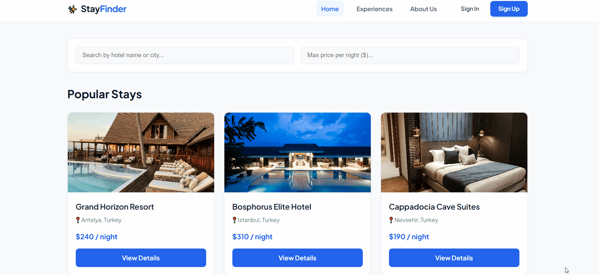
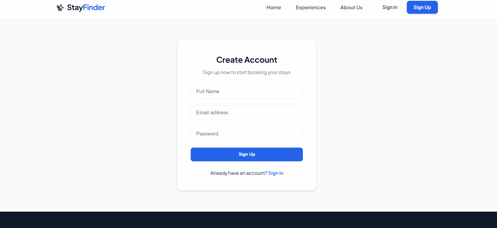
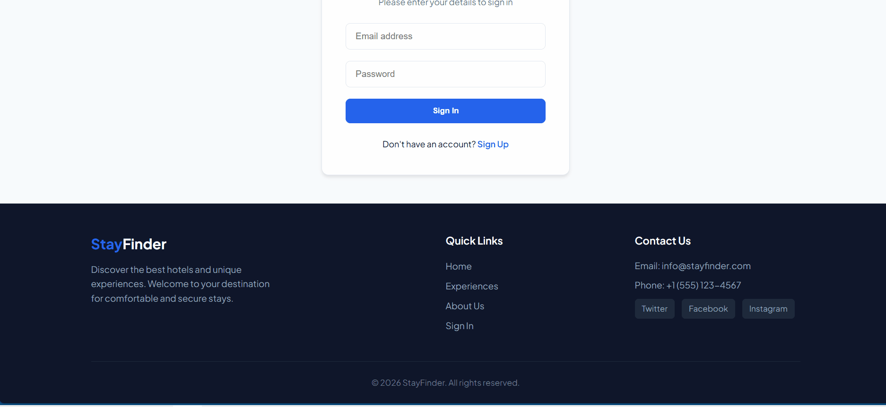
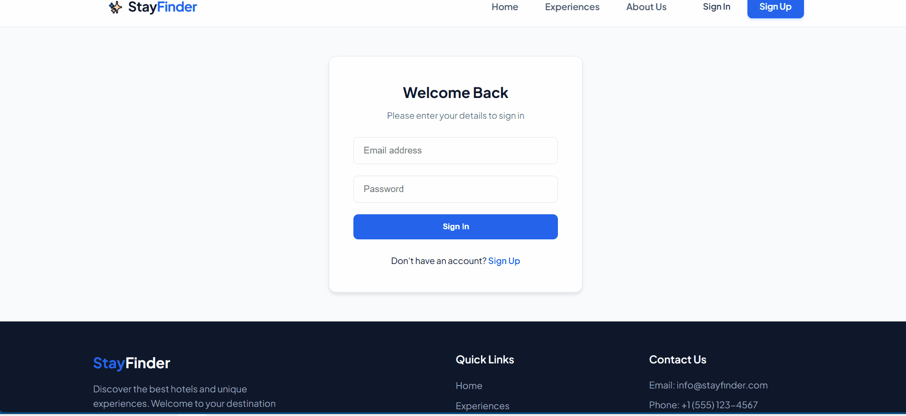

# 🏨 Hotel Booking System (StayFinder)

A modern, full-stack hotel booking and management platform. Built on the MERN stack, it allows users to search for hotels and make reservations while providing admins with tools to manage hotels and booking workflows.

---
## 🎬 Application Demos

<div align="center">

### Overview & Features Showcase









</div>


## ✨ Features

### 👤 User Side
- **User Authentication:** Secure JWT-based registration and login system.
- **Hotel Search & Filter:** Real-time search by hotel name or location (city/country).
- **Booking Management:** Seamless reservation process with check-in/check-out date validation and past-date prevention.
- **My Bookings:** View active and past reservations with an option to cancel eligible bookings.
- **Experiences & About:** Informational pages featuring curated local tours, activities, and platform details.
- **Responsive & Modern UI:** Mobile-ready hamburger menu, skeleton loaders, and Toastify notifications.

### 🛠 Admin Side
- **Admin Management Panel:** Protected route accessible only to authorized admin accounts (`AdminRoute`).
- **Hotel Management:** Add new hotels, view existing listings, and delete hotels (`DELETE`).
- **Booking Oversight:** Monitor all user reservations across the platform.

---

## 📂 Project Structure

```text
hotel-booking/
├── backend/            # Express.js API & MongoDB Models
│   ├── config/         # Database connection configuration
│   ├── controllers/    # Auth, Hotel, and Booking logic
│   ├── models/         # Mongoose schemas
│   ├── routes/         # API endpoints
│   └── server.js       # Main server entry point
├── frontend/           # React Client UI
│   ├── src/
│   │   ├── api/        # Axios configuration
│   │   ├── components/ # Navbar, Footer, Route Guards
│   │   ├── context/    # AuthContext (Global state)
│   │   └── pages/      # Home, HotelDetail, AdminDashboard, etc.
└── README.md
```
🚀 Getting Started
------------------

Follow these steps to get the project up and running locally:

### 1\. Clone the Repository

    git clone https://github.com/dxtaner/hotel-booking.git
    cd hotel-booking

### 2\. Backend Setup

    cd backend
    npm install

Create a `.env` file in the `backend` directory and add your environment variables:

    PORT=5000
    MONGO_URI=mongodb://localhost:27017/hotel-booking
    JWT_SECRET=super_secret_jwt_key_123

Start the backend server:

    npm start

### 3\. Frontend Setup

Open a new terminal tab and navigate to the frontend folder:

    cd frontend
    npm install

Start the React development server:

    npm run dev   # or npm start

The application will run locally at `http://localhost:5173` (or `http://localhost:3000`).

* * *

### 🔒 API Endpoints

Method

Endpoint

Description

Auth Required

`POST`

`/api/auth/register`

Register a new user account

None

`POST`

`/api/auth/login`

Authenticate user & get access token

None

`GET`

`/api/hotels`

Fetch all available hotel listings

None

`POST`

`/api/hotels`

Create a new hotel listing

Admin

`DELETE`

`/api/hotels/:id`

Delete an existing hotel listing

Admin

`GET`

`/api/bookings/my-bookings`

Fetch current user's booking history

User

`POST`

`/api/bookings`

Create a new hotel reservation

User

`GET`

`/api/bookings/admin/all`

Fetch all platform-wide reservations

Admin

* * *

### 📝 License

This project is licensed under the **MIT License**. See the `LICENSE` file for details.
